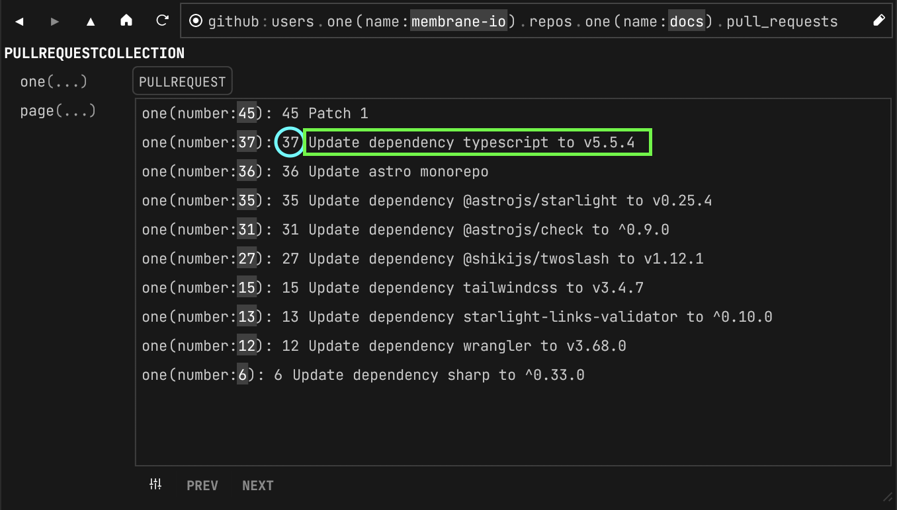

A Membrane program's graph is defined by its _schema_, autogenerated in `<your-program>/memconfig.json` based on the schema you configure in the Navigator panel.

The schema is a set of types that represent nodes in the program's graph. Nodes can be _fields_, _actions_, or _events_.

- **Fields**: queryable nodes and values
- **Actions**: invocable functions on a node
- **Events**: subscribable notifications

<video src="/cloud-assets/schema.mp4" muted autoplay loop></video>

## Root Type

Schemas must include a `Root` type which defines the type of the program's _root
node_. This node serves as the entry point into the program—all references are relative to the root node.

Nodes are referred to by the program's name followed by a colon and then a path to the node from the `Root` type. For example:

- `github:` refers to the root node of the <a href="https://github.com/membrane-io/membrane-driver-github" target="_blank">github driver</a>
- `twitter:` refers to the root node of the <a href="https://github.com/membrane-io/membrane-driver-twitter" target="_blank">twitter driver</a>
- `github:users.one(name:"membrane-io")` refers to a Github `User`
- `github:users.one(name:"membrane-io").repos.one(name:"directory")` refers to a `Repository`

## Fields

Fields are queryable nodes that hold values you can read. From the <a href="https://github.com/membrane-io/membrane-driver-github" target="_blank">github driver</a>:

- `github:status` is a field of type `String` via the `status` field on the `Root` type
- `github:users` is a field of type `UserCollection` via the `users` field on the `Root` type
- `github:users.one(name:"membrane-io")` refers to a node of type `User`
- `github:users.one(name:"juancampa")` refers to _another_ node of type `User`

The two last examples show that parameters can be passed to fields where each combination of parameters
represent a different node in the graph.

We call these references _handles_ or _grefs_ (short for graph reference).

## Hints

Hints provide information on how fields should be displayed in the Navigator.

### Preview
With preview hints, you can mark fields as `primary` and `secondary` to use them as previews in the Navigator, e.g. in a list of paginated results.
```json
{
  "name": "name",
  "type": "String",
  "hints": {
    "primary": true
  },
  "description": "An example of a type"
}
```

With ```secondary: true```, you can make a field the second portion of that preview
```json
{
  "name": "name",
  "type": "String",
  "hints": {
    "secondary": true
  },
  "description": "An example of a type"
}
```

*Primary in blue, secondary in green.*




### Format
The format hint allows you to format a string as a URL in the Navigator.
```json
{
  "name": "url",
  "type": "String",
  "description": "The URL of the Pull Request",
  "hints": {
    "format": "url"
  }
}

### Hidden
The hidden hint can be used to mark a field that should not be displayed in the Navigator.

```json
{
  "name": "phone_number",
  "type": "String",
  "description": "The customer's phone number",
  "hints": {
    "hidden": true
  }
}


## Actions

Actions are functions that can be invoked in the context of a graph node. Note that since actions are graph nodes too, they can be passed around and referenced just like fields.

## Events

Events are members on a type which can be "emitted" by programs when something of interest happens on one of its nodes. Other programs can subscribe to get notified.

Programs can subscribe an action to handle an event. When an event is emitted, the action will be invoked with an additional parameter called `event`.
